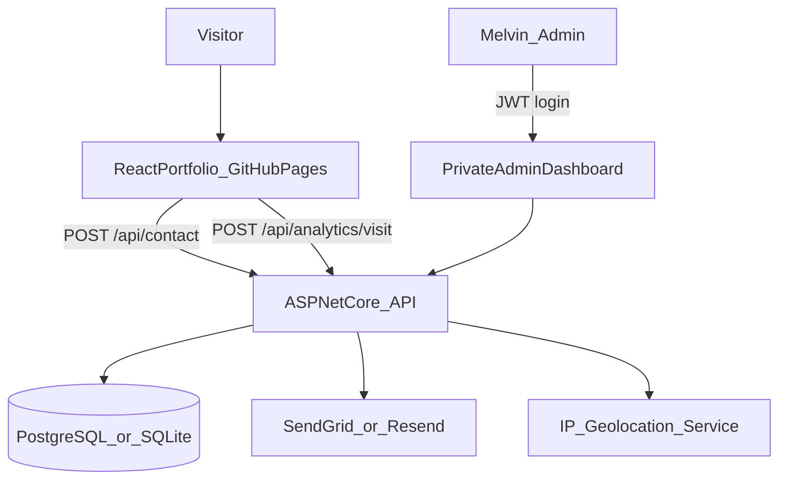

# Melvin Thomas Portfolio — React + ASP.NET Core

## Recommended architecture (GitHub Pages constraint)

GitHub Pages serves **static files only** — no ASP.NET, Express, or server-side logic can run there. The correct split is:

| Layer | Tech | Hosting |
|-------|------|---------|
| Public portfolio | React (Vite) | **GitHub Pages** |
| API + analytics + email | **ASP.NET Core Web API** | **Render** (free tier, simple deploy) or **Azure App Service** (aligns with your resume) |
| Database | SQLite (dev) → PostgreSQL on Render / Azure SQL | With backend |

**Why ASP.NET Core over Express:** Your resume positions you as a **.NET Full Stack Developer** (ASP.NET Core, EF, SQL Server, Azure DevOps). A small, well-structured API + analytics backend is a strong recruiter signal and matches the stack you already ship at Grid Dynamics.



---

## Portfolio content (from [Melvin_Thomas_D.pdf](Melvin_Thomas_D.pdf))

**Hero:** Melvin Thomas D — .NET Full Stack Developer — Chennai  
**Pitch:** ~2 years enterprise healthcare apps; ASP.NET Core, Angular/React, SQL Server, Azure DevOps.

**Sections:**
- **About Me** — Summary from resume + professional photo placeholder (you can add later)
- **Skills** — Grouped: Frontend, Backend, Database, DevOps, AI/Automation, Practices
- **Experience** — Grid Dynamics (Junior Software Developer, UI Intern) with bullet highlights
- **Projects** (2 featured cards):
  - *Enterprise Management System* — Angular, ASP.NET Core, SQL Server (role-based auth, CRUD, dashboards)
  - *AI Requirement Assistant* — Angular, ASP.NET Core, Azure OpenAI (requirements → user stories/tasks)
- **Education & Certifications** — Jeppiaar Institute (BE CSE, 8.7 CGPA); Google Cloud Certified Specialist
- **Contact** — Form + direct links (email, LinkedIn, GitHub, phone optional)

**Design direction (recruiter / LinkedIn audience):** Clean, modern, light theme with one accent color (e.g. deep blue or teal), strong typography (Inter + a display font for headings), smooth scroll nav, subtle fade-in animations—not flashy. Mobile-first responsive layout.

---

## Repo structure

```
CURSOR_AI/
├── frontend/                 # React + Vite → GitHub Pages
│   ├── src/
│   │   ├── components/       # Navbar, Hero, About, Skills, Projects, Experience, Contact
│   │   ├── admin/            # Private dashboard (auth-gated route)
│   │   ├── hooks/            # useAnalytics, useDeviceInfo
│   │   ├── services/         # api.js (contact + analytics beacons)
│   │   └── data/             # resumeContent.js (editable copy)
│   └── vite.config.js        # base: '/repo-name/' for GitHub Pages
├── backend/                  # ASP.NET Core Web API
│   ├── Controllers/
│   │   ├── ContactController.cs
│   │   ├── AnalyticsController.cs
│   │   └── AuthController.cs
│   ├── Services/
│   │   ├── EmailService.cs
│   │   ├── GeoLocationService.cs
│   │   └── TrafficSourceParser.cs
│   ├── Models/               # ContactSubmission, PageVisit, AdminUser
│   └── Data/                 # EF Core DbContext
└── .github/workflows/
    └── deploy-frontend.yml   # Build + deploy to gh-pages on push
```

---

## Feature 1: Contact form + email with metadata

**Frontend (`Contact` section):**
- Fields: Name, Email, Subject, Message
- Client sends: `referrer`, `landingPage`, `utmSource/Medium/Campaign`, `deviceType` (parsed from viewport + UA), `sessionId` (anonymous UUID in localStorage)

**Backend (`POST /api/contact`):**
- Validates input, rate-limits by IP (basic spam protection)
- Enriches server-side:
  - **Location:** IP → country/state/city via free geo API (e.g. ip-api.com or ipinfo.io with env API key)
  - **Device:** Parse `User-Agent` (Mobile / Tablet / Desktop)
  - **Traffic source:** Classify from referrer + UTM (`direct`, `linkedin`, `google`, `other`)
- Persists row in DB
- Sends email to `melvinthomas.tech@gmail.com` via **SendGrid** or **Resend** (free tier) with form body + all metadata block

**Email example block:**
```
From: Jane Recruiter (jane@company.com)
Message: ...

--- Visitor Metadata ---
Location: Chennai, Tamil Nadu, India
Device: Mobile
Traffic: linkedin / social (utm_source=linkedin)
Referrer: https://linkedin.com/...
Session: abc-123-uuid
```

---

## Feature 2: General visitor tracking (no form)

**Frontend analytics beacon** (fires on load + SPA route changes):
- `POST /api/analytics/visit` with: `pagePath`, `referrer`, UTM params, `sessionId`, client `deviceType`
- Debounced; no PII collected from casual visitors

**Backend:**
- Same enrichment pipeline as contact (IP geo + UA + traffic classification)
- Stores anonymous `PageVisit` records
- Does **not** email on page views

**Privacy note (important for recruiters):** Add a brief footer line: *"Anonymous usage analytics collected to improve this site."* No cookies banner needed if no ad tracking—just session UUID in localStorage.

---

## Feature 3: Private admin dashboard (you only)

**Route:** `/admin` on the React app — **not linked** in public navbar  
**Auth:** Single admin account; JWT issued by `POST /api/auth/login` (username + password from env vars, bcrypt-hashed)  
**Dashboard panels:**
- Total visits / unique sessions (7d, 30d, all time)
- **Location:** bar chart — top countries / cities
- **Device:** pie — Mobile / Tablet / Desktop
- **Traffic source:** pie — Direct / LinkedIn / Search / Other
- **Contact submissions table:** name, email, date, location, source — click to expand message

All dashboard API routes require `Authorization: Bearer <token>`.

---

## Deployment plan

1. **Backend first** → Deploy ASP.NET Core API to Render (or Azure App Service)
   - Set env vars: `DATABASE_URL`, `SENDGRID_API_KEY`, `ADMIN_USERNAME`, `ADMIN_PASSWORD_HASH`, `JWT_SECRET`, `CORS_ORIGIN=https://<username>.github.io`
2. **Frontend** → Push to GitHub; GitHub Actions builds Vite app and publishes to `gh-pages` branch
   - `VITE_API_BASE_URL` points to deployed API URL
3. **LinkedIn sharing** → Use URL with UTM:  
   `https://<username>.github.io/<repo>/?utm_source=linkedin&utm_medium=social`  
   so LinkedIn traffic shows clearly in your dashboard

---

## Key implementation files

| File | Purpose |
|------|---------|
| [frontend/src/services/api.js](frontend/src/services/api.js) | Contact submit + analytics beacon |
| [frontend/src/admin/Dashboard.jsx](frontend/src/admin/Dashboard.jsx) | Private charts + submissions table |
| [backend/Controllers/ContactController.cs](backend/Controllers/ContactController.cs) | Form handler + email trigger |
| [backend/Controllers/AnalyticsController.cs](backend/Controllers/AnalyticsController.cs) | Visit logging + dashboard aggregates |
| [backend/Services/GeoLocationService.cs](backend/Services/GeoLocationService.cs) | IP → location enrichment |
| [.github/workflows/deploy-frontend.yml](.github/workflows/deploy-frontend.yml) | CI/CD to GitHub Pages |

---

## What you'll need to provide before deploy

- GitHub repo name (for Vite `base` path)
- LinkedIn profile URL (resume lists "Linkedin" without URL)
- GitHub profile URL (optional, for Contact links)
- SendGrid or Resend API key (free signup)
- Render/Azure account for backend hosting
- Choose backend host: **Render** (fastest free setup) or **Azure** (stronger resume alignment)

---

## Out of scope (kept simple)

- No CMS — content lives in `resumeContent.js`, easy to edit
- No real-time WebSocket dashboard — refresh on load is enough
- No Express.js backend — ASP.NET Core chosen to match your profile and requirements
